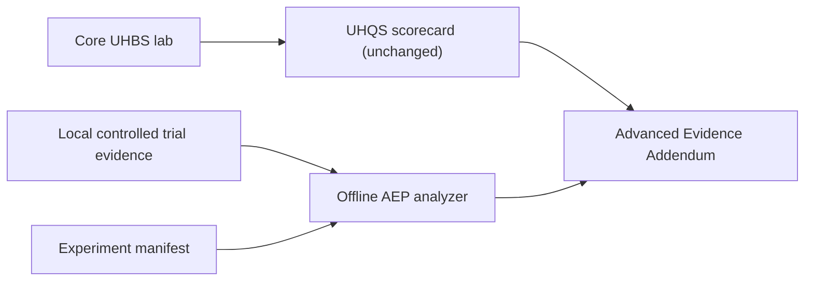

# Advanced Evidence Profile (AEP)

**Status:** Optional · informative · offline analysis only  
**UHBS version:** 4.5.2 · **AEP schema version:** 1.0.0  
**Evaluation scope:** Laboratory / sandbox only — **not** real-world production testing

!!! danger "Lab evaluation only"
    UHBS and AEP are for **isolated lab and sandbox evaluation** of decoys.
    Do not point harnesses, collectors, or AEP trial collection at production
    systems, customer environments, or unauthorized targets. The optional
    UHQS &gt; 80 “production baseline” is an *internal gate after lab grading*,
    not permission to test in the real world.

UHQS remains the normative implementation-quality and safety grade. The optional
**Advanced Evidence Profile** adds controlled **lab** evidence about adversarial
perception, engagement, distinguishability, and cost under declared experimental
conditions. **AEP does not change UHQS.**

**Academic credit:** AEP’s design vocabulary draws on cited research (Zhu 2019;
Collins et al. 2024; Ersok et al. 2022; Li et al. 2020). See
[Research foundations & credits](research-foundations.md) — citing those works
does not imply their authors endorse UHBS.

## What AEP is

AEP is a **lab controlled-experiment layer** that supplements a valid UHBS
scorecard with evidence about:

- whether a decoy changes attacker/agent behavior relative to a **matched lab reference**
- engagement (dwell, exchanges, capability expenditure)
- distinguishability across fingerprint layers (with TPR/FPR)
- defender utility deltas under an **explicit** utility model (VoD)

## What AEP is not

- Not a replacement for Modules A–F
- Not part of UHQS, δ_C, weights, or letter grade
- Not a certification or “proven against all attackers” claim
- **Not real-world / production testing** — lab and sandbox only
- Not permission to test production systems, customer networks, or unauthorized targets
- **Not an attack launcher** — `uhbs aep` only reads local files
- Attestations require `sandbox_only` and `no_production_assets`

## Who should use it

Honeypot developers, academic researchers, red teams, deception engineers, and
evaluators comparing LLM / ICS / tarpit behavior in **sandboxed lab studies**.

## Decision guide

| Goal | Use |
| --- | --- |
| Implementation quality / release gate | Ordinary UHBS scorecard (Modules A–F, UHQS) |
| Controlled decoy-versus-reference evidence | **Add AEP** |
| Organization or campaign maturity | CDMM / Engage — [related frameworks](../mappings/related-frameworks.md) |

## Status vocabulary

AEP reports `valid | inconclusive | control_failed` — **not** pass/fail grades.

## Optional SLM evaluator (alpha)

For labs that want help **drafting** AEP trial JSONL with a small/local model
(or a deterministic mock) before offline analyze:

- **[SLM evaluator (alpha)](slm-alpha.md)** — what it is for, activation checklist,
  providers (`mock` / `recorded` / loopback `openai_compatible`)
- **Default: off.** Install does not enable it; you must edit `aep-slm.yaml`.
- **Does not change UHQS.** Not exposed via AI-host MCP.
- Published: https://uhbs.github.io/uhbs-standard/mkdocs/advanced-evidence/slm-alpha/

Most users should start with ordinary AEP tutorials and skip SLM until they need it.

## Start here

1. [Beginner tutorial](tutorial-beginner.md) — `uhbs aep example beginner` then analyze
2. [CLI reference](cli.md) — `pip install 'uhbs[aep]'`
3. [Methodology](methodology.md) · [Metrics](metrics.md) · [Runbook](runbook.md)
4. [Research foundations](research-foundations.md)
5. Optional: [SLM evaluator (alpha)](slm-alpha.md) — **off by default**; edit
   `aep-slm.yaml` to unlock (does not change UHQS)

## Related

- [Related deception frameworks](../mappings/related-frameworks.md)
- [CLI & Validator](../tooling/cli.md)
- [Improvement notes (informative)](improvement-notes.md)
- Landing hub: [Advanced Evidence Profile](https://uhbs.github.io/uhbs-standard/#advanced-evidence)
