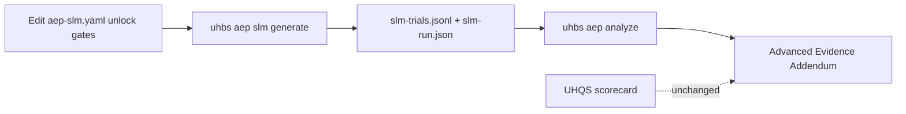

# AEP SLM evaluator (alpha)

**Status:** alpha · **Default:** **off** · **UHQS impact:** none  
**Extra:** [`uhbs[aep-slm]`](https://github.com/uhbs/uhbs-standard/blob/main/pyproject.toml) (marker extra; same runtime deps as [`uhbs[aep]`](cli.md))  
**Published docs:** [this page on GitHub Pages](https://uhbs.github.io/uhbs-standard/mkdocs/advanced-evidence/slm-alpha/)

!!! danger "Opt-in alpha — not activated by install"
    Installing UHBS or `uhbs[aep]` / `uhbs[aep-slm]` does **not** enable the
    SLM evaluator. Generation stays locked until you **edit a local
    `aep-slm.yaml`** (enable flag + unlock phrase + attestations). Lab /
    sandbox only. Never point at production systems.

## What it is for

UHQS grades **implementation quality and safety** from Modules A–F.
[AEP](index.md) adds optional **lab** decoy-vs-reference evidence (VoD, FSV,
DTDR, EER) from local trial files.

Collecting those trials by hand (or with your own harness) is the normal path.
The **SLM evaluator** is an optional alpha helper for labs that want a
**small / local language model** (or a deterministic mock) to help *draft*
synthetic AEP trial rows for offline `uhbs aep analyze` — for example when
prototyping an experiment design, dry-running the analyzer, or replaying
recorded model outputs.

It is **not** a replacement for real controlled trials, **not** a UHQS input,
and **not** a certification claim about any honeypot or LLM.



## Who should use it

| Audience | Typical use |
| --- | --- |
| Researchers / students | Dry-run AEP pipelines with `provider: mock` before collecting real trials |
| Lab engineers | Replay `recorded` JSONL from a local model evaluation |
| Advanced local setups | Call a **loopback-only** OpenAI-compatible server after explicit unlock |

If you only need UHQS or ordinary offline AEP on hand-written trials, **skip this
feature** — leave configs disabled.

## What it does

| Step | Behavior |
| --- | --- |
| [`uhbs aep slm init`](cli.md#aep-slm) | Writes a **disabled** `aep-slm.yaml` |
| `uhbs aep slm validate` / `status` | Schema + activation report (no model calls) |
| `uhbs aep slm generate` | Only if fully unlocked; writes trials + `slm-run.json` |
| [`uhbs aep analyze`](cli.md#uhbs-aep-analyze) | Unchanged offline analyzer on the generated trials |

## What it does not do

- Does **not** change UHQS / scorecards / Modules A–F / δ_C / weights
- Does **not** launch honeypot probes, SSH, Docker, or `uhbs-lab`
- Does **not** call remote cloud APIs from the default `mock` path
- Does **not** enable tool/function calling
- Does **not** auto-activate via environment variables, install extras, or CLI flags alone
- Is **not** exposed over the AI-host MCP server ([tooling/mcp](../tooling/mcp.md))

## Activation checklist (edit the config file)

Packaged and `init` configs ship with:

```yaml
enabled: false
activation:
  unlock_phrase: CHANGE_ME_SEE_DOCS
  acknowledge_alpha: false
  lab_sandbox_only: false
  no_production_targets: false
  no_uhqs_scoring_impact: false
  allow_local_model_calls: false
```

To unlock generation, change **all** of the following in the YAML file:

1. `enabled: true`
2. `activation.unlock_phrase: I_ENABLE_AEP_SLM_ALPHA` (exact string)
3. `acknowledge_alpha`, `lab_sandbox_only`, `no_production_targets`, and
   `no_uhqs_scoring_impact` → `true`
4. For `provider: openai_compatible` only, also
   `activation.allow_local_model_calls: true`
   (`mock` and `recorded` may leave this `false`)

CLI flags alone cannot unlock a locked file. There is no interactive “yes I know”
prompt that bypasses the file edits.

## Providers

| Provider | Network | Notes |
| --- | --- | --- |
| `mock` (default) | None | Deterministic offline JSON; recommended for CI / dry runs |
| `recorded` | None | Replay local JSONL (`content` string or `response` object) |
| `openai_compatible` | Loopback only | `endpoint.base_url` must be `127.0.0.1` / `localhost` / `::1`; **HTTP redirects refused**; response body size-capped |

Schema `safety.*` constants require loopback-only, no tools, no network targets,
and local file writes only. Model JSON fields are parsed strictly (booleans must
be JSON booleans — the string `"false"` is rejected).

## Quick start (mock, after unlock)

```bash
pip install 'uhbs[aep-slm]'
uhbs aep example beginner --out aep-beginner
cd aep-beginner
uhbs aep slm init --out aep-slm.yaml --experiment experiment.yaml
# Edit aep-slm.yaml: enabled + unlock phrase + activation booleans (see above)
# Align generation.trials_per_arm with experiment repetitions.minimum_per_arm
uhbs aep slm validate aep-slm.yaml
uhbs aep slm generate aep-slm.yaml
uhbs aep validate-trials slm-trials.jsonl --experiment experiment.yaml
uhbs aep analyze \
  --experiment experiment.yaml \
  --trials slm-trials.jsonl \
  --out advanced-evidence.json
uhbs aep report advanced-evidence.json --format markdown --out ADVANCED-EVIDENCE.md
```

Default/locked generate attempt (expected failure):

```bash
uhbs aep slm generate aep-slm.yaml
# → error: generation blocked … enabled is not true …
```

## Schemas & provenance

| Artifact | Location |
| --- | --- |
| Config schema | [`schemas/aep-slm.schema.json`](https://github.com/uhbs/uhbs-standard/blob/main/schemas/aep-slm.schema.json) |
| Trial schema (optional `evaluator`) | [`schemas/aep-trial.schema.json`](https://github.com/uhbs/uhbs-standard/blob/main/schemas/aep-trial.schema.json) |
| Locked template (repo) | [`examples/advanced-evidence/slm/`](https://github.com/uhbs/uhbs-standard/tree/main/examples/advanced-evidence/slm) |
| Run provenance | `slm-run.json` (`uhqs_unchanged: true`, model/prompt/seed) |

Generated trials may include `evaluator.kind: slm` and `evaluator.status: alpha`
for provenance only.

## Alpha caveats

- API and prompt IDs may change without a UHBS major version bump
- Model / mock outputs are **synthetic lab evidence** — informative, not certification
- Prefer `mock` or `recorded` for reproducible papers; document model digest when using local servers
- Keep `generation.trials_per_arm` ≥ the experiment’s `repetitions.minimum_per_arm`

## Related

- [AEP overview](index.md) · [MkDocs AEP home](https://uhbs.github.io/uhbs-standard/mkdocs/advanced-evidence/)
- [AEP CLI reference](cli.md)
- [Beginner tutorial](tutorial-beginner.md) (ordinary AEP without SLM)
- [CLI & validator](../tooling/cli.md)
- [Changelog (Unreleased)](https://github.com/uhbs/uhbs-standard/blob/main/CHANGELOG.md)
- Landing hub: https://uhbs.github.io/uhbs-standard/ · AEP overview: https://uhbs.github.io/uhbs-standard/mkdocs/advanced-evidence/
